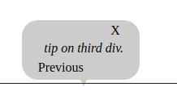

# GLS Player

Guided Learning System Player is open source javascript library to integrate with your web applicatons. GP will support both single page and multipage web applications and web pages. This is an usefull tool to help the user to kwon more about your application and give them some tip/help to configure, use and or register to the application.

## Advantage

- Jquery not required runs on plain javascript.
- Support Jquery `eq` selector.
- Support `iframe` based applications, can pass document referance.
- Support shuffled arry.

### Usage

Include player js in your project:

```html
<script src="player.js"></script>
```

Initilaze GLS Player using steps array:

```javascript
GLSPlayer.init(Object settings, Array steps, document referenceDocument);
```

Example:

```javascript
GLSPlayer.init({ replay: 'FALSE' }, [{
    "id": "1",
    "content": "tip on first div",
    "selector": "#id_1",
    "next": "2"
},
{
    "id": "3",
    "content": "tip on third div.",
    "selector": "div:eq(2)",
    "next": null,
},
{
    "id": "2",
    "content": "tip on second div",
    "selector": ".myClass2",
    "next": "3",
}], document);
```

Initilaze GLS Player using json:

```javascript
GLSPlayer.init(Object settings, String jsonPath, document referenceDocument);
```

Example:

```javascript
var settings = {
    keyboardEvents: true
};
GLSPlayer.init(settings,'./guide.json',document);
```

Start player:

```javascript
GLSPlayer.play();
```

Example 1:

```html
<body onload="GLSPlayer.play();">
```

Example 2:

```html
<button onclick="GLSPlayer.play();">Help Me</button>
```

## APIS

| Methods           | Description                       | Arguments  | Optinal  |
| -----------       | ----------------------------      | ---------- | -------  |
| init();           | initialize GLS Player             | `settings`, `[steps]/'jsonPath'`,`referenceDocuments` | `settings`, `referenceDocuments` |
| play();           | Start GLS Palyer                  | tipwindow | NILL |
| replay();         | Replay Player from the begining.  | NILL | NA |
| goto();           | Navigate the player to controll with id                             | id | NILL |
| next();           | Navigate to next tip                              | NILL | NA |
| previous();       | Navigate to previous tip | NILL | NA |                                   |
| skip();           | Skip next tip                             | NILL | NA |
| getFirstPage();   | Returns the first order item `index`                              | NILL | NA |
| stop();           |                                   | NILL | NA |
| reset();          | Reset the player                             | NILL | NA |
| hide();           | Hide the tip window                              | NILL | NA |
| show();           | Sho the tip window                                  | NILL | NA |

### Settings

- replay string `TRUE | FALSE` default 'TRUE'.
- keyboardEvents boolean `true | false`  default 'TRUE'.

### Shortcuts

Settings use `keyboardEvents: true` to enable keyboard shortcuts default `true`:

- Right arrow `next();`
- Left arrow `previous();`

### Custom template

GLS Player supports custom template for tip window. This `HTMLElement` reference can be passed as an argument of `play();` method.

#### Guide for custom template

 This feature allow you to create any custom template of your choice. Please follw the guide for best result.

- Add `class="gls-arrow"` to the pointer element.
- Add `class="gls-previous"` to the previous button element.
- Add `class="button gls-next"` to the next button element.

### Default Template

GLS Player comes with a default template. Which can be optionaly enable during `play()` if no arguments passed.

#### Output



### Todo

- Unit testing
- Accurate and custom positioning of tip window.
- Documentation
- Intro before play
- Add more examples
- Integrate build with npm
- create npm package
- All browser support
- Context menu support get tip of particular element
- Validate input JSON using JSON schema
